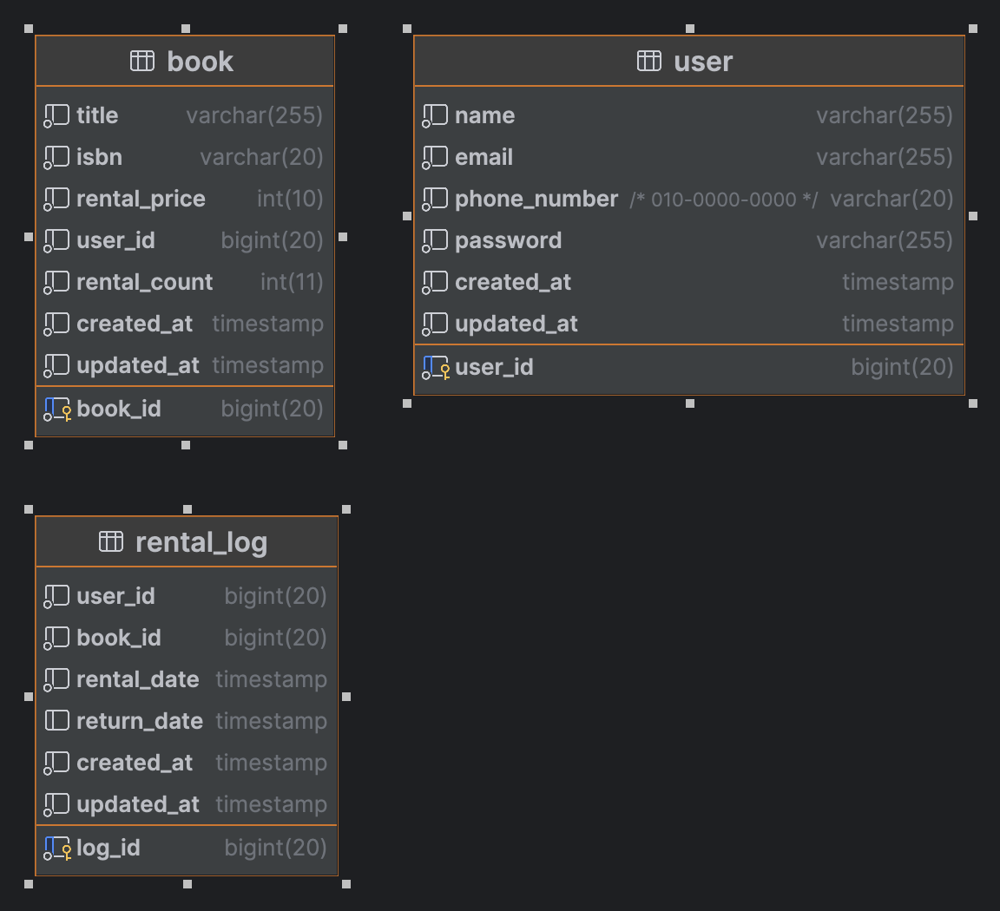

# 우리들의 도서관 백엔드 과제전형-송은지

   
## 프로젝트 환경 
- Java : 17이상
- Framework : Spring boot3
- Database : Mariadb 
- Api 문서 : Swagger
- 사용자 인증 방식 : JWT

## 애플리케이션 실행 문서 
URL : https://lucy-song.notion.site/API-007d741609114e32b29b6e77f86ffa59?pvs=4

# DB Table

